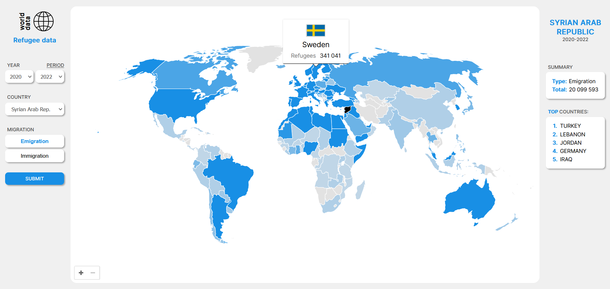

# World map

### About

**World map** is a web app that displays various data on an interactive world map.
This project is built using React with the help of the following libraries:
* Formik (https://formik.org/docs/overview)
* svgMap (https://github.com/StephanWagner/svgMap)
* Country Data (https://github.com/OpenBookPrices/country-data)

### Run locally

1. Clone the repo
   ```sh
   git clone git@github.com:domas404/world-map.git
   ```
2. Install NPM packages
   ```sh
   npm install
   ```
3. Run the server
   ```sh
   node server.js
   ```
4. Start React app
    ```sh
    cd client
    npm start
    ```

### Usage

Select year, country and migration type to see how many refugees have left their countries and where they went during the selected time period.



### Data sources
* Refugee data (https://www.kaggle.com/datasets/sujaykapadnis/refugees)

<p align="right">(<a href="#world-map">back to top</a>)</p>